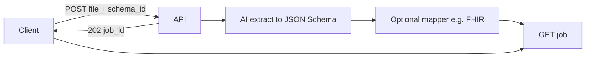

# Viome Document Intelligence

FastAPI service that extracts **structured JSON from uploaded documents**
(PDF, JPEG, PNG) using a pluggable AI model. You choose a registered
extraction schema (`schema_id`); the model returns the smallest JSON that
schema describes. Jobs are async: submit a file, poll by `job_id`.

FHIR mapping and HL7 validation are **one downstream adapter** used today
for lab-report schemas — not the product. Adding a schema is how you
teach the API a new document type; mapping to FHIR (or anything else) is
optional follow-on work for that schema.

## When to use it

- Turn a report or scan into schema-constrained JSON for an internal
  caller (one user per request, `X-Viome-User-Id`).
- Swap extractors via `X-AI-Model` (`gemini` is the v1 default).
- Keep extraction cheap and retryable: the model never has to emit FHIR.

v1 does not persist files, authenticate callers, or run a durable queue
(in-memory jobs; lost on restart / multi-worker). Trusted network only.

## Local development

    pip install -r requirements.txt
    cp .env.example .env   # set GEMINI_API_KEY
    uvicorn app.main:app --reload --port 8020

`GET /health` should return `{"status": "ok"}`.

## Docker

App on **8020**, optional FHIR validator sidecar on **8021**:

    make up          # docker compose up --build -d
    make logs
    make down

Local uvicorn against a sidecar validator: set `FHIR_VALIDATOR_URL` to
`http://localhost:8021` (see `.env.example`).

## Extraction schemas

JSON Schema files live in `app/schemas/` as `*.extract.schema.json`.
The filename stem is the `schema_id` you pass on upload.

Shipped today:

| `schema_id`           | Extracts |
|-----------------------|----------|
| `lab_observation`     | One lab value |
| `multi_observation`   | A panel / several values |

Unknown `schema_id` → `400`.

## API

- `GET /health` — liveness.
- `POST /extractions` — multipart `file` + `schema_id`. Headers:
  `X-Viome-User-Id` (required), `X-AI-Model` (optional, default `gemini`).
  Accepted types: PDF / JPEG / PNG, max 20 MiB (configurable).
  Returns `202 {"job_id": "..."}`.
- `GET /extractions/{job_id}` — `pending` | `processing` | `succeeded` |
  `failed`. On success, `result` is the mapped output for that schema
  (currently a FHIR `Observation` or `Bundle` for the lab schemas). On
  failure, `error.reason` + `error.detail`.

Example:

    curl -s -X POST http://localhost:8020/extractions \
      -H "X-Viome-User-Id: test-user-1" \
      -F "file=@report.pdf;type=application/pdf" \
      -F "schema_id=multi_observation"

    curl -s http://localhost:8020/extractions/<job_id>

`./ingest-test.sh` is a convenience wrapper that polls this API and can
forward a succeeded payload to a gateway. The worker itself does not
call any gateway.

## Flow

## Tests

    pytest -v

## Lab / FHIR adapter (optional)

Only needed if you care about the current lab-report output shape:

    make sushi-build          # compile fhir-ig FSH → StructureDefinitions
    make init                 # register profile + Organization with Aidbox
                              # (needs AIDBOX_* in .env)

Design notes: `docs/superpowers/specs/2026-09-10-document-intelligence-design.md`.
